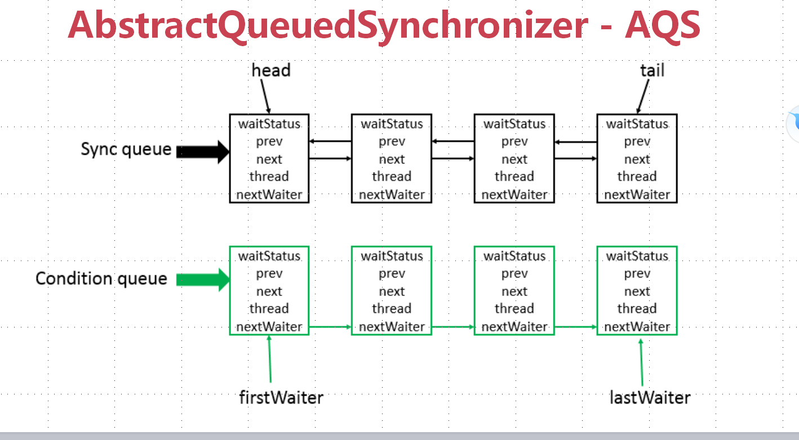

# concurrent-aqs

## 7 J.U.C之AQS
[返回主目录](../README.md)

### 7.1 AQS
    使用Node实现FIFO队列，可以用于构建锁或者其他同步装置的基础框架
    利用了一个int类型表示状态
    使用方法是继承
    子类通过继承并通过实现它的方法管理其状态{acquire和release}的方法操作状态
    可以通过实现排它锁和共享锁模式（独占、共享）



### 7.2 J.U.C之AQS-CountDownLatch（闭锁）
```java
    
    //CountDownLatch最好用final修饰
    final CountDownLatch countDownLatch = new CountDownLatch(1000);
    
    //将countDown()放入finally代码块中执行
    countDownLatch.countDown();
    
    countDownLatch.await();
    countDownLatch.await(1,TimeUnit.SECONDS);
    
    countDownLatch.getCount();
```

### 7.3 J.U.C之AQS-Semaphore（信号量）
```java

    //Semaphore最好用final修饰
    final Semaphore semaphore = new Semaphore(10);

    //获取一个许可
    semaphore.acquire();
    //获取多个许可
    semaphore.acquire(1);
    
    //释放一个许可
    semaphore.release();
    //释放多个许可
    semaphore.release(1);
    
    //尝试获取一个许可
    semaphore.tryAcquire();
    //尝试获取一个许可，设置超时时间
    semaphore.tryAcquire(1,TimeUnit.SECONDS);
    //尝试获取多个许可，设置超时时间
    semaphore.tryAcquire(1,1,TimeUnit.SECONDS);
```
### 7.4 J.U.C之AQS-CyclicBarrier（栅栏）
```java
    
    //CyclicBarrier最好用final修饰
    final CyclicBarrier cyclicBarrier = new CyclicBarrier(10);
    
    //该代码上面部分准备，下面的代码等有10个准备，再统一执行。
    cyclicBarrier.await();
    cyclicBarrier.await(1,TimeUnit.SECONDS);
```
### 7.5 J.U.C之AQS-ReentrantLock与锁