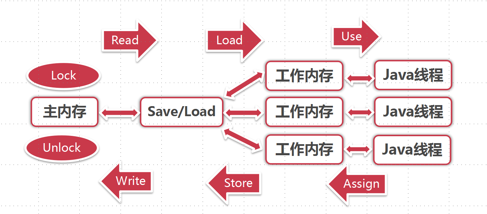

# concurrent-basic

## 2 并发基础

### 2.1 CPU多级缓存-缓存一致性
CPU多级缓存：CPU的频率太快了，快到主存跟不上。（cpu->cache->memory）

### 2.2 CPU多级缓存-乱序执行优化
处理器为提高运算速度而做出违背代码原有顺序的优化。

### 2.3 JAVA内存模型

#### 2.3.1 JMM

#### 2.3.2 同步操作规则

### 2.4 并发的优势与风险

