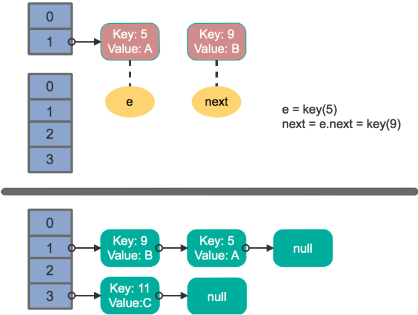
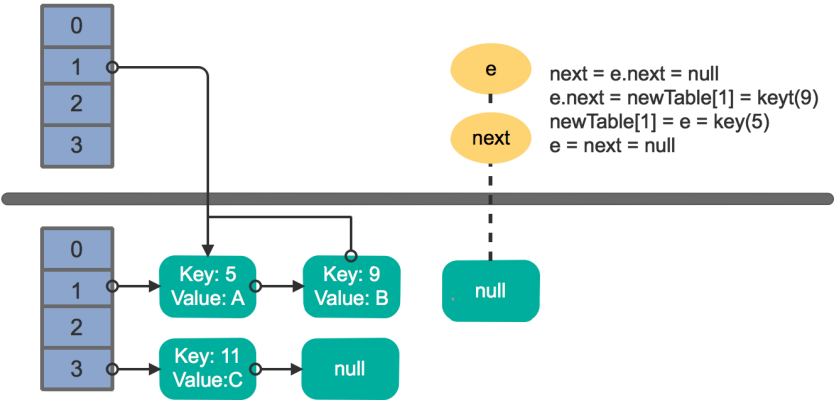
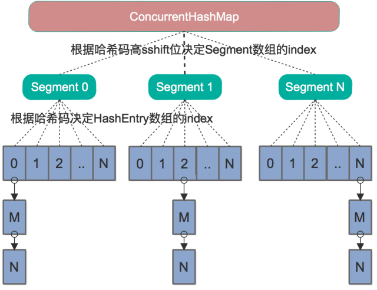

# concurrent-basic

## 9 线程调度-线程池
[返回主目录](../README.md)

### 9.1 new Thread 弊端
    每次new Thread 新建对象，性能差
    线程缺乏统一管理，可能无限制的新建线程，相互竞争，有可能占用过多系统资源导致死机或OOM（out of memory）
    缺少更多功能，如更多执行、定期执行、线程中断

### 9.2 线程池的好处
    重用存在的线程，减少对象创建、消亡的开销，性能佳
    可有效控制最大并发线程数，提高系统资源利用率，同时可以避免过多资源竞争，避免阻塞
    提供定时执行、定期执行、单线程、并发数控制等功能
    
### 9.3 深入理解Java之线程池
    http://www.importnew.com/19011.html
    
### 9.4 线程状态

### 9.5 线程类图

### 9.6 线程池-合理配置
    CPU密集型任务，就需要尽量压榨CPU，参考值可以设为NCPU+1
    IO密集型任务，参考值可以设置为2*NCPU
   
## 10 多线程并发扩展 

### 10.1 死锁 - 必要条件
    互斥条件
    请求和保持条件
    不剥夺条件
    环路等待条件
### 10.2 多线程并发最佳实践
    使用本地变量
    使用不可变类
    最小化锁的作用域范围：S=1/(1-a+a/n)
    使用线程池的Executor，而不是直接new Thread执行
    宁可使用同步也不要使用线程的wait和notify
    使用BlockingQueue实现生产-消费模式
    使用并发集合而不是加了锁的同步集合
    使用Semaphore创建有界的访问
    宁可使用同步代码块，也不使用同步的方法
    避免使用静态变量
### 10.3 Spring与线程安全
    Spring bean：singleton、prototype
    无状态对象
### 10.4 HashMap与ConcurrentHashMap

http://www.importnew.com/28263.html

单线程下的rehash操作：

多线程下的rehash操作：

### 10.5 总结

