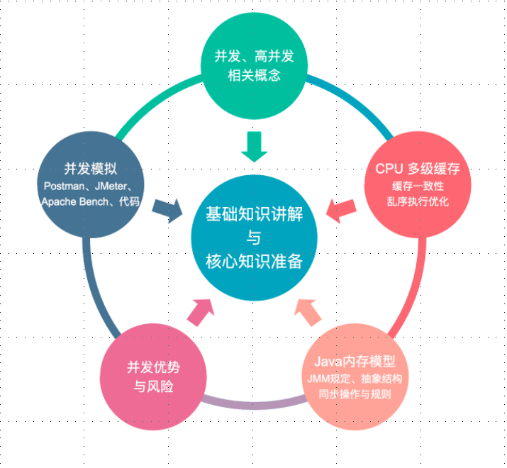

# concurrent-prepare

## 1 课程准备
[返回主目录](../README.md)

### 1.1 并发与高并发基本概念

#### 1.1.1 并发（Concurrency）

多个线程操作相同的资源，保证线程安全，合理使用资源。

#### 1.1.2 高并发（High Concurrency）

服务能同时并行处理很多请求，提高程序性能。

### 1.2 课程内容

