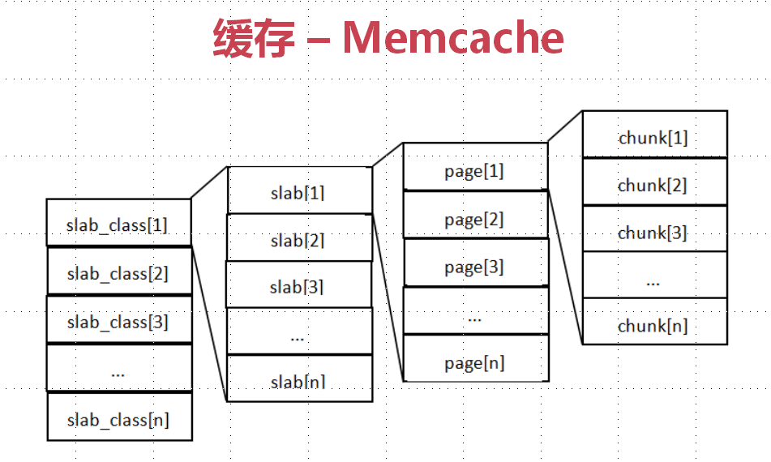
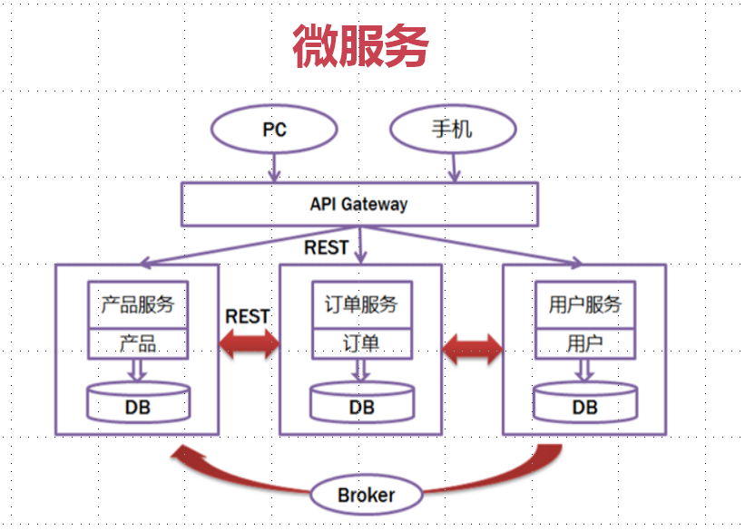

# concurrent-solution

## 11 高并发解决方案
[返回主目录](../README.md)

### 第11章 高并发之扩容思路（纵横之术）

#### 11.1 扩容

垂直扩容(纵向扩展)：提高系统部件能力（CPU、内存、固态硬盘、硬盘容量）

水平扩容(横向扩展)：增加更多系统成员来实现（增加相同配置的服务器）

#### 11.2 扩容-数据库

读操作扩展：Memcache、Redis、CDN等缓存

写操作扩展：Cassandra、Hbase等

### 第12章 高并发之缓存思路（缓兵之计）

#### 12.1 缓存

#### 12.2 缓存特征

命中率：命中数/(命中数+没有命中数)

最大元素（空间）

清空策略：FIFO,LFU,LRU,过期时间,随机等

##### 12.2.1 缓存命中率影响因素
    业务场景和业务需求
    缓存的设计（粒度和策略）
    缓存容量和基础设施

#### 12.3 缓存分类

本地缓存：应用程序（成员变量、局部变量、静态变量）、Guava Cache

分布式缓存：Memcache、Redis

##### 12.3.1 Guava Cache

##### 12.3.2 Memcache

##### 12.3.3 Redis

#### 12.4 缓存问题

##### 12.4.1 缓存一致性

##### 12.4.2 缓存并发问题
加锁缓存，将key为null设置为缓存，value值为"null"

##### 12.4.3 缓存穿透问题
缓存缺失，击穿数据库（缓存过期时间设置为随机数）

##### 12.4.4 缓存的雪崩现象

问题1. redis 有20万个key需要缓存，如果缓存时间都是一样的，势必会在同一时间大量数据会击穿数据库，导致服务器瘫痪，我们该怎么解决？

答案：将缓存时间设置为随机数！

问题2.redis里面有一万个缓存的id，但是前台伪造了10万个ID，请求成功后存入redis key为ID，由于伪造ID所以value为null！所以还会击穿数据库，导致服务器瘫痪，我们该怎么解决？

答案：将缓存的Value设置为None！

### 第13章 高并发之消息队列思路（异步之法）

#### 13.1 消息队列特性
    业务无关：只做消息分发
    FIFO：先投递先到达
    容灾：节点的动态增删和消息持久化
    性能：吞吐量提升，系统内部通信效率提高
#### 13.2 为什么需要消息队列
    生产和消费的速度或稳定性等因素不一致
#### 13.3 消息队列好处
    业务解耦
    最终一致性
    广播
    错峰与流控
    
#### 13.3 消息队列类别-Kafka
    

### 第14章 高并发之应用拆分思路（化繁为简）
#### 14.1 能力中心
    用户中心（基础数据维护）、账户中心（流程处理、定时任务）、通知中心（短信、邮件、推送）

#### 14.2 应用拆分原则
    业务优先
    循序渐进
    兼顾技术：重构、分层
    可靠测试
#### 14.3 应用拆分思考    
    
    应用之间通信：RPC（Dubbo、HSF等）、消息队列
    应用之间数据库设计：每个应用都有独立的数据库
    避免事务操作跨应用
  

### 第15章 高并发之应用限流思路

#### 15.1 限流
恒定速率

#### 15.2 限流算法

计数器法 VS 滑动窗口

漏桶算法 VS 令牌桶算法

### 第16章 高并发之服务降级与服务熔断思路

自动降级：超时、失效次数、故障、限流

人工降级：秒杀、双11大促等

### 第17章 高并发之数据库切库分库分表思路

#### 17.1 数据库瓶颈

单个库数据量太大（1T~2T）：多个库

单个数据库服务器压力过大、读写瓶颈：多个库

单个表数据量过大：分表

#### 17.2 数据库分表

横向（水平）分表：同样结构不同数据

纵向（垂直）分表：按照列的活跃度进行分表

数据库分表：Mybatis分表插件shardbatis2.0

### 第18章 高并发之高可用手段介绍

任务调度系统分布式：elastic-job + zookeeper、xxl-job

主备切换：
apache curator + zookeeper分布式锁实现
redis分布式锁实现

监控报警机制

### 第19章 课程总结
   
 