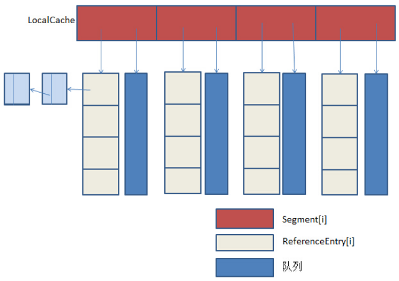

# concurrent-solution

## 11 高并发解决方案
[返回主目录](../README.md)

### 第11章 高并发之扩容思路

#### 11.1 扩容（纵横之术）

垂直扩容(纵向扩展)：提高系统部件能力（CPU、内存、固态硬盘、硬盘容量）

水平扩容(横向扩展)：增加更多系统成员来实现（增加相同配置的服务器）

#### 11.2 扩容-数据库

读操作扩展：Memcache、Redis、CDN等缓存

写操作扩展：Cassandra、Hbase等

### 第12章 高并发之缓存思路

#### 12.1 缓存（缓兵之计）

#### 12.2 缓存特征

命中率：命中数/(命中数+没有命中数)

最大元素（空间）

清空策略：FIFO,LFU,LRU,过期时间,随机等

##### 12.2.1 缓存命中率影响因素
    业务场景和业务需求
    缓存的设计（粒度和策略）
    缓存容量和基础设施

#### 12.3 缓存分类

本地缓存：应用程序（成员变量、局部变量、静态变量）、Guava Cache

分布式缓存：Memcache、Redis

##### 12.3.1 Guava Cache

##### 12.3.2 Memcache

##### 12.3.3 Redis

#### 12.4 缓存问题

##### 12.4.1 缓存一致性

##### 12.4.2 缓存并发问题
加锁缓存，将key为null设置为缓存，value值为"null"

##### 12.4.3 缓存穿透问题
缓存缺失，击穿数据库（缓存过期时间设置为随机数）

##### 12.4.4 缓存的雪崩现象

问题1. redis 有20万个key需要缓存，如果缓存时间都是一样的，势必会在同一时间大量数据会击穿数据库，导致服务器瘫痪，我们该怎么解决？

答案：将缓存时间设置为随机数！

问题2.redis里面有一万个缓存的id，但是前台伪造了10万个ID，请求成功后存入redis key为ID，由于伪造ID所以value为null！所以还会击穿数据库，导致服务器瘫痪，我们该怎么解决？

答案：将缓存的Value设置为None！

### 第13章 高并发之消息队列思路